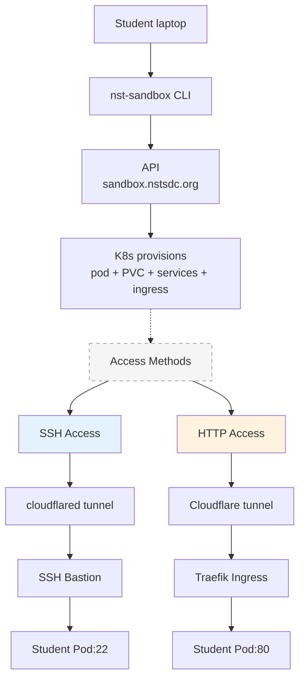

# Student Sandbox System (v2)

A self-service cloud platform that gives students isolated Linux containers on the NST K3s cluster. Students choose their image, compute tier, and storage — then SSH in and deploy. Think mini-EC2 instances, running on campus infrastructure.

**Repo:** [github.com/nst-sdc/nst-sandbox](https://github.com/nst-sdc/nst-sandbox) (branch: `v2`)

---

## User Guide

### How it works



Each instance is an isolated Linux container. Students pick from available images:

| Image | Description |
|-------|-------------|
| **ubuntu-22.04** | Ubuntu 22.04 LTS minimal — SSH + sudo. Install anything with `apt`. EC2-style experience. |
| **alpine-web** | Alpine + nginx + Node.js + git. Web sandbox with a live site at `<name>.nstsdc.org`. |

### Quick start

#### 1. Install the CLI

```bash
curl -sL https://sandbox.nstsdc.org/install | bash
```

Installs `cloudflared` (for SSH tunneling) and the `nst-sandbox` CLI.

#### 2. Create an instance

```bash
nst-sandbox create my-devbox
```

Interactive prompts let you pick:
- **Image** — Ubuntu, Alpine, etc.
- **Compute tier** — T1 (0.5 vCPU/512MB), T2 (1 vCPU/1GB), T3 (2 vCPU/2GB)
- **Storage** — S1 (500MB) through S5 (10GB) for your files
- **Lifespan** — Persistent or 24-hour (auto-deleted)

Or use flags for non-interactive creation:

```bash
nst-sandbox create my-devbox --image ubuntu-22.04 --tier T2 --storage S3
nst-sandbox create lab-temp --image alpine-web --tier T1 --storage S1 --24h
```

#### 3. Connect and work

```bash
nst-sandbox ssh my-devbox
```

On Ubuntu images, you can install anything:

```bash
sudo apt update
sudo apt install -y nginx
sudo nginx
curl localhost   # nginx welcome page
```

Your site is live at `http://my-devbox.nstsdc.org`.

### CLI reference

```bash
nst-sandbox create [name]       # Create instance (interactive)
nst-sandbox create name --image ubuntu-22.04 --tier T2 --storage S3 --24h
nst-sandbox list                # List your instances
nst-sandbox ssh <name>          # SSH into instance
nst-sandbox info <name>         # Show instance details
nst-sandbox destroy <name>      # Delete instance
nst-sandbox images              # Show available images and tiers
nst-sandbox help                # Show help
```

### Multiple instances

You can have as many instances as you need. Each has its own name, image, and resources:

```bash
nst-sandbox create web-project --image alpine-web --tier T1 --storage S2
nst-sandbox create devops-lab --image ubuntu-22.04 --tier T2 --storage S3 --24h
nst-sandbox list
```

Credentials for all your instances are saved in `~/.nst-sandbox/instances.json`.

### 24-hour instances

For labs and lectures, create ephemeral instances that auto-delete after 24 hours:

```bash
nst-sandbox create lab-nginx --image ubuntu-22.04 --24h
```

You'll be asked to confirm before creation. After 24 hours, the instance and all its data are permanently deleted.

### Storage

Your files are stored on a persistent volume mounted at `/home/<username>`. This survives pod restarts. However, anything installed via `apt` or `apk` lives in the container's ephemeral layer — if the pod restarts, those packages are gone (your files are safe).

### Troubleshooting

| Problem | Solution |
|---------|----------|
| Can't connect / cloudflared not found | Re-run installer: `curl -sL https://sandbox.nstsdc.org/install \| bash` |
| Website not loading | Check your app listens on port 80 |
| Lost password | Run `nst-sandbox info <name>` to see saved credentials |
| "Name already taken" | Choose a different instance name |
| Packages disappeared after restart | Expected — apt installs are ephemeral. Your files in /home are safe. |

---

## For Instructors

### Admin Web UI

Access at **sandbox.nstsdc.org/admin** with the admin key.

Features:
- **Dashboard** — total instances, breakdown by image/tier/status
- **Instances** — list all with filter, bulk select, bulk delete, purge inactive
- **Images** — manage the image catalog (add/edit/disable images)
- **Config** — edit admin key, purge thresholds, etc.

### Bulk operations

From the admin UI:
- **Delete All** — wipe every instance (double confirmation required)
- **Purge Inactive** — delete instances not accessed for N days
- **Bulk Select + Delete** — select specific instances and delete

Useful after a lab session: delete all 24h instances, or purge everything.

### Adding new images

1. Write a Dockerfile that:
   - Runs `sshd` on port 22
   - Accepts `STUDENT_USER` and `STUDENT_PASS` env vars
   - Creates the user with sudo access in the entrypoint
2. Build and push to the cluster registry:
   ```bash
   docker build -t localhost:30500/nst-sandbox-<name>:latest .
   docker push localhost:30500/nst-sandbox-<name>:latest
   ```
3. Add to catalog via admin UI (Images → Add Image)
4. Students see it immediately in `nst-sandbox images`

### API endpoints

**Public:**

| Method | Endpoint | Description |
|--------|----------|-------------|
| `GET` | `/api/images` | Available images + tiers |
| `POST` | `/api/instances` | Create instance (returns token) |
| `GET` | `/api/instances/:name` | Instance info |
| `DELETE` | `/api/instances/:name` | Delete (Bearer token) |
| `GET` | `/health` | Health check |
| `GET` | `/install` | Installer script |
| `GET` | `/client` | CLI script |

**Admin** (requires `X-Admin-Key` header):

| Method | Endpoint | Description |
|--------|----------|-------------|
| `GET` | `/admin/api/instances` | All instances |
| `GET` | `/admin/api/stats` | Dashboard stats |
| `DELETE` | `/admin/api/instances/:name` | Force delete |
| `DELETE` | `/admin/api/instances` | Bulk delete (`{names: [...]}` or `{filter: "all"}`) |
| `POST` | `/admin/api/purge` | Purge inactive (`{days: 30}`) |
| `GET/POST/PUT/DELETE` | `/admin/api/images/*` | Image catalog CRUD |
| `GET/PUT` | `/admin/api/config` | Config management |

### Resource planning

| Tier | Per Instance | 50 Students |
|------|-------------|-------------|
| T1 | 512MB RAM, 0.5 CPU | 25GB RAM, 25 CPU |
| T2 | 1GB RAM, 1 CPU | 50GB RAM, 50 CPU |
| T3 | 2GB RAM, 2 CPU | 100GB RAM, 100 CPU |

These are limits, not reservations. Requests are much lower (T1: 128MB/100m). The cluster can overcommit safely since students won't all max out simultaneously.

---

## Architecture

### Components

```
┌──────────────────────────────────────────────────────────────────────┐
│                         NST Sandbox v2                               │
│                                                                      │
│  ┌─────────────┐   ┌──────────────┐   ┌──────────────────────────┐  │
│  │  Client CLI  │──▶│  Backend API │──▶│  K8s (kubectl)           │  │
│  │  (bash)      │   │  (Node.js)   │   │  Namespaces, Pods, PVCs  │  │
│  │  curl|bash   │   │  + SQLite    │   │  Services, Ingresses     │  │
│  └─────────────┘   │  + Admin UI  │   └──────────────────────────┘  │
│                     └──────────────┘                                 │
│  ┌─────────────┐                       ┌──────────────────────────┐  │
│  │  SSH Bastion │◀── cloudflared ──────▶│  Student Pods            │  │
│  │  (ssh2 proxy)│                       │  Ubuntu / Alpine / ...   │  │
│  └─────────────┘                       └──────────────────────────┘  │
└──────────────────────────────────────────────────────────────────────┘
```

- **API Server** — Node.js + SQLite, manages the image catalog, instances, and K8s provisioning
- **SSH Bastion** — Node.js ssh2 proxy, routes SSH connections to the right pod via ClusterIP lookup
- **Student Pods** — one per instance, in isolated `sandbox-<name>` namespaces
- **Client CLI** — bash script, talks to the API, stores tokens locally

### Per-instance K8s resources

Each instance gets its own namespace containing:
- **Pod** — runs the chosen image with student user/password from env vars
- **PVC** — persistent storage mounted at `/home/<username>`
- **Service (NodePort)** — SSH access
- **Service (ClusterIP)** — HTTP for ingress
- **Ingress** — `<name>.nstsdc.org` → pod port 80

### Database

SQLite with three tables:
- **images** — catalog of available container images
- **instances** — all created instances with token, tier, storage, status, timestamps
- **config** — admin settings (admin key, purge threshold, etc.)

### Background jobs

Running in the API server:
- **Expiry sweep** (every 5 min) — deletes 24h instances past their `expires_at`
- **Status sync** (every 1 min) — checks pod phases via kubectl, updates SQLite

### Networking

| Surface | Route |
|---------|-------|
| SSH | `sandbox-ssh.nstsdc.org` → cloudflared → bastion (30022) → pod ClusterIP:22 |
| HTTP | `<name>.nstsdc.org` → cloudflared → Traefik → Ingress → pod ClusterIP:80 |
| API | `sandbox.nstsdc.org` → cloudflared → Traefik → API pod:3000 |

### Repo structure

```
nst-sandbox/
├── api/                     # Backend API server
│   ├── server.js            # HTTP server with all endpoints
│   ├── db.js                # SQLite schema + queries
│   ├── k8s.js               # kubectl wrapper
│   ├── provisioner.js       # Create/delete/stop/start logic
│   ├── jobs.js              # Background expiry + sync
│   └── package.json
├── admin/
│   └── index.html           # Admin web UI (Vue.js + semantic HTML)
├── bastion/
│   ├── server.js            # SSH proxy with last_accessed tracking
│   ├── Dockerfile
│   └── package.json
├── images/
│   ├── ubuntu-22.04/        # Ubuntu EC2 simulator image
│   └── alpine-web/          # Alpine web sandbox image
├── client/
│   ├── nst-sandbox          # Student CLI (bash)
│   └── install.sh           # curl|bash installer
├── public/
│   └── index.html           # Landing page at sandbox.nstsdc.org
├── k8s/
│   ├── api-deployment.yaml  # API: RBAC, PVC, deployment, ingress
│   ├── bastion-deployment.yaml
│   └── instance-template.yaml  # Per-instance K8s manifest template
├── Dockerfile               # API server container image
├── ARCHITECTURE.md          # Detailed architecture document
└── README.md
```

### Deploy

```bash
# Build images (on nst-n1)
docker build -t localhost:30500/nst-sandbox-ubuntu:latest images/ubuntu-22.04/
docker build -t localhost:30500/nst-sandbox-alpine:latest images/alpine-web/
docker build -t localhost:30500/nst-sandbox-api:latest .

# Push
docker push localhost:30500/nst-sandbox-ubuntu:latest
docker push localhost:30500/nst-sandbox-alpine:latest
docker push localhost:30500/nst-sandbox-api:latest

# Deploy
kubectl apply -f k8s/api-deployment.yaml
kubectl apply -f k8s/bastion-deployment.yaml
```

### Cloudflare Tunnel config

```yaml
ingress:
  - hostname: "sandbox-ssh.nstsdc.org"
    service: ssh://localhost:30022
  - hostname: "sandbox.nstsdc.org"
    service: http://localhost:80
  - hostname: "*.nstsdc.org"
    service: http://localhost:80
```
